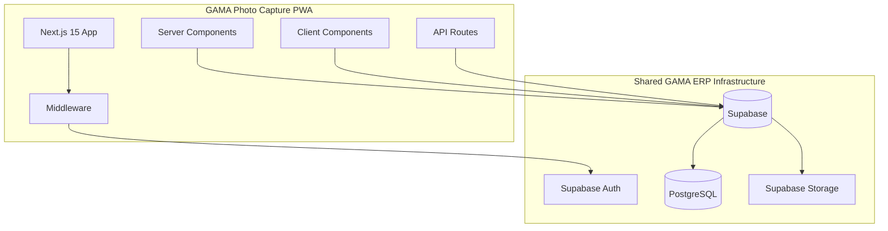
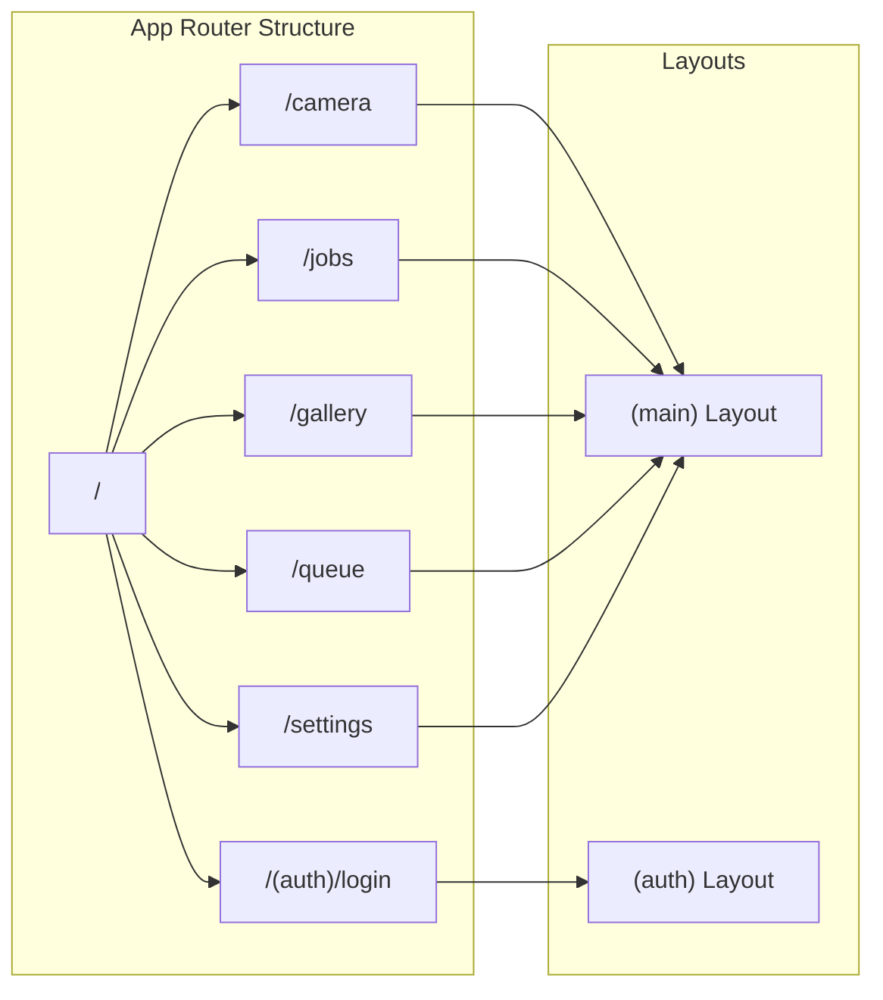
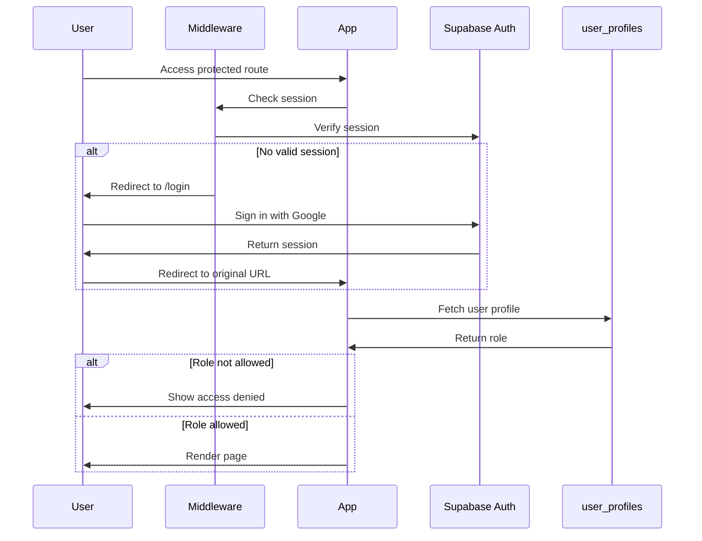
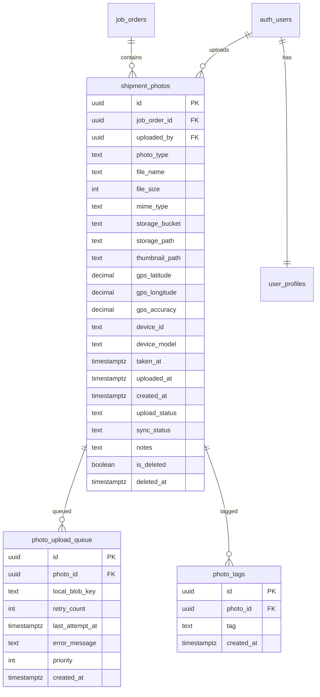

# Design Document: v0.1-foundation

## Overview

This design document outlines the technical architecture for the foundation phase of GAMA Photo Capture PWA. The phase establishes the core infrastructure including a Next.js 15 application with TypeScript, authentication integration with the shared GAMA ERP Supabase project, an app shell with navigation, and database schema setup.

The design prioritizes:
- **Shared Infrastructure**: Reusing GAMA ERP's Supabase project for authentication and data
- **Type Safety**: Strict TypeScript throughout the codebase
- **Component Architecture**: Atomic design principles for maintainable UI components
- **PWA Foundation**: Basic manifest and service worker for future offline capabilities
- **Security**: Role-based access control and Row Level Security policies

## Architecture

### High-Level Architecture



### Application Structure



### Authentication Flow



## Components and Interfaces

### Directory Structure

```
app/
├── (auth)/
│   └── login/
│       └── page.tsx           # Login page with Google OAuth
├── (main)/
│   ├── layout.tsx             # Main layout with AppShell
│   ├── camera/
│   │   └── page.tsx           # Camera placeholder
│   ├── jobs/
│   │   └── page.tsx           # Jobs placeholder
│   ├── gallery/
│   │   └── page.tsx           # Gallery placeholder
│   ├── queue/
│   │   └── page.tsx           # Queue placeholder
│   └── settings/
│       └── page.tsx           # Settings placeholder
├── api/                       # API routes (future phases)
├── layout.tsx                 # Root layout
├── page.tsx                   # Root redirect to /camera
└── manifest.ts                # PWA manifest

components/
├── atoms/
│   └── offline-indicator.tsx  # Online/offline status
├── molecules/
│   └── (future components)
├── organisms/
│   ├── app-header.tsx         # Top header component
│   └── bottom-nav.tsx         # Bottom navigation
├── templates/
│   └── app-layout.tsx         # Main app shell template
└── ui/                        # shadcn/ui components

lib/
├── supabase/
│   ├── client.ts              # Browser Supabase client
│   ├── server.ts              # Server Supabase client
│   └── middleware.ts          # Auth middleware helper
└── utils/
    └── (utility functions)

middleware.ts                  # Next.js middleware for auth
types/
├── supabase.ts               # Generated Supabase types
└── index.ts                  # App-specific types
```

### Component Interfaces

```typescript
// components/organisms/app-header.tsx
interface AppHeaderProps {
  title: string;
  showBack?: boolean;
  showQueue?: boolean;
}

// components/organisms/bottom-nav.tsx
interface BottomNavProps {
  currentPath: string;
}

interface NavItem {
  href: string;
  label: string;
  icon: React.ComponentType<{ className?: string }>;
}

// components/atoms/offline-indicator.tsx
interface OfflineIndicatorProps {
  isOnline: boolean;
}

// components/templates/app-layout.tsx
interface AppLayoutProps {
  children: React.ReactNode;
  title: string;
  showBack?: boolean;
}
```

### Supabase Client Interfaces

```typescript
// lib/supabase/server.ts
export async function createClient(): Promise<SupabaseClient>;

// lib/supabase/client.ts
export function createClient(): SupabaseClient;

// lib/supabase/middleware.ts
export async function updateSession(
  request: NextRequest
): Promise<NextResponse>;
```

### Authentication Types

```typescript
// types/index.ts
export type AllowedRole = 
  | 'owner' 
  | 'director' 
  | 'operations_manager' 
  | 'operations' 
  | 'ops' 
  | 'engineer';

export interface UserProfile {
  user_id: string;
  full_name: string;
  email: string;
  role: AllowedRole;
  avatar_url?: string;
}

export interface AuthState {
  user: User | null;
  profile: UserProfile | null;
  isLoading: boolean;
  error: string | null;
}
```

## Data Models

### Database Schema



### TypeScript Types for Database

```typescript
// types/photo.ts
export type PhotoType = 'before' | 'after' | 'damage' | 'document' | 'survey' | 'other';
export type UploadStatus = 'pending' | 'uploading' | 'completed' | 'failed';
export type SyncStatus = 'local' | 'syncing' | 'synced';

export interface ShipmentPhoto {
  id: string;
  job_order_id: string | null;
  uploaded_by: string;
  photo_type: PhotoType;
  file_name: string;
  file_size: number;
  mime_type: string;
  storage_bucket: string;
  storage_path: string;
  thumbnail_path: string | null;
  gps_latitude: number | null;
  gps_longitude: number | null;
  gps_accuracy: number | null;
  device_id: string | null;
  device_model: string | null;
  taken_at: string;
  uploaded_at: string | null;
  created_at: string;
  upload_status: UploadStatus;
  sync_status: SyncStatus;
  notes: string | null;
  is_deleted: boolean;
  deleted_at: string | null;
}

export interface PhotoUploadQueue {
  id: string;
  photo_id: string;
  local_blob_key: string;
  retry_count: number;
  last_attempt_at: string | null;
  error_message: string | null;
  priority: number;
  created_at: string;
}

export interface PhotoTag {
  id: string;
  photo_id: string;
  tag: string;
  created_at: string;
}
```

### Environment Variables

```typescript
// Required environment variables
interface EnvConfig {
  NEXT_PUBLIC_SUPABASE_URL: string;      // Supabase project URL
  NEXT_PUBLIC_SUPABASE_ANON_KEY: string; // Supabase anon key
  NEXT_PUBLIC_APP_URL: string;           // App URL for redirects
}
```

### PWA Manifest Structure

```typescript
// app/manifest.ts
export default function manifest(): MetadataRoute.Manifest {
  return {
    name: 'GAMA Photo Capture',
    short_name: 'Photo Capture',
    description: 'Field photo capture for GAMA ERP logistics operations',
    start_url: '/',
    display: 'standalone',
    background_color: '#ffffff',
    theme_color: '#0f172a',
    icons: [
      {
        src: '/icons/icon-192.png',
        sizes: '192x192',
        type: 'image/png',
      },
      {
        src: '/icons/icon-512.png',
        sizes: '512x512',
        type: 'image/png',
      },
      {
        src: '/icons/maskable-icon.png',
        sizes: '512x512',
        type: 'image/png',
        purpose: 'maskable',
      },
    ],
  };
}
```


## Correctness Properties

*A property is a characteristic or behavior that should hold true across all valid executions of a system—essentially, a formal statement about what the system should do. Properties serve as the bridge between human-readable specifications and machine-verifiable correctness guarantees.*

Based on the prework analysis of acceptance criteria, the following properties have been identified for property-based testing:

### Property 1: Environment Variable Validation

*For any* Supabase client initialization attempt where required environment variables (NEXT_PUBLIC_SUPABASE_URL or NEXT_PUBLIC_SUPABASE_ANON_KEY) are missing or empty, the initialization SHALL throw an error with a descriptive message indicating which variable is missing.

**Validates: Requirements 2.5**

### Property 2: Unauthenticated Request Redirect

*For any* HTTP request to a protected route (camera, jobs, gallery, queue, settings) without a valid authentication session, the middleware SHALL respond with a redirect to the login page.

**Validates: Requirements 3.2, 5.2**

### Property 3: Role Verification on Authentication

*For any* authenticated user, the application SHALL query the user_profiles table and verify the user's role is in the allowed roles set before granting access to protected features.

**Validates: Requirements 4.1**

### Property 4: Access Denied for Invalid Roles

*For any* authenticated user whose role is not in the allowed roles set (owner, director, operations_manager, operations, ops, engineer), the application SHALL display an access denied message and prevent access to protected features.

**Validates: Requirements 4.3**

### Property 5: URL Preservation on Redirect

*For any* unauthenticated request to a protected route, the middleware SHALL preserve the original requested URL in a query parameter or session, such that after successful authentication the user is redirected back to the originally requested page.

**Validates: Requirements 5.4**

### Property 6: Header Title Rendering

*For any* string value passed as the title prop to the AppHeader component, the rendered output SHALL contain that exact string value in the header area.

**Validates: Requirements 6.4**

### Property 7: Active Tab Highlighting

*For any* valid route path passed as currentPath to the BottomNav component, the navigation tab corresponding to that path SHALL have a visually distinct active state (different styling) compared to inactive tabs.

**Validates: Requirements 7.2**

## Error Handling

### Authentication Errors

| Error Scenario | Handling Strategy |
|----------------|-------------------|
| No session found | Redirect to /login with return URL |
| Session expired | Clear session, redirect to /login |
| OAuth provider error | Display error message on login page |
| Network error during auth | Show retry option with error message |

### Role Authorization Errors

| Error Scenario | Handling Strategy |
|----------------|-------------------|
| User has no profile | Display "Profile not found" error |
| User role not allowed | Display "Access Denied" page with contact info |
| Profile fetch fails | Show error toast, allow retry |

### Environment Configuration Errors

| Error Scenario | Handling Strategy |
|----------------|-------------------|
| Missing SUPABASE_URL | Throw error with clear message at startup |
| Missing SUPABASE_ANON_KEY | Throw error with clear message at startup |
| Invalid URL format | Throw error with validation message |

### UI Error States

```typescript
// Error boundary for catching React errors
interface ErrorBoundaryState {
  hasError: boolean;
  error: Error | null;
}

// Toast notifications for user feedback
type ToastType = 'success' | 'error' | 'warning' | 'info';

interface ToastConfig {
  type: ToastType;
  message: string;
  duration?: number;
}
```

## Testing Strategy

### Dual Testing Approach

This phase uses both unit tests and property-based tests for comprehensive coverage:

- **Unit tests**: Verify specific examples, edge cases, and component rendering
- **Property tests**: Verify universal properties across all valid inputs

### Property-Based Testing Configuration

- **Library**: fast-check for TypeScript property-based testing
- **Minimum iterations**: 100 per property test
- **Tag format**: `Feature: v0.1-foundation, Property {number}: {property_text}`

### Test Categories

#### Unit Tests

1. **Component Rendering Tests**
   - AppHeader renders with title
   - BottomNav renders all five tabs
   - OfflineIndicator shows correct state
   - Login page renders OAuth button

2. **Route Tests**
   - All placeholder pages render without error
   - Root path redirects to /camera
   - Login page is accessible without auth

3. **Configuration Tests**
   - Supabase clients are properly configured
   - PWA manifest has required fields
   - Environment variables are validated

#### Property-Based Tests

1. **Property 1**: Environment variable validation
   - Generate random combinations of missing/present env vars
   - Verify error thrown when required vars missing

2. **Property 2**: Unauthenticated redirect
   - Generate random protected route paths
   - Verify all redirect to login without session

3. **Property 3**: Role verification
   - Generate random user profiles with various roles
   - Verify role check is performed

4. **Property 4**: Access denied for invalid roles
   - Generate random non-allowed roles
   - Verify access denied is shown

5. **Property 5**: URL preservation
   - Generate random protected route URLs
   - Verify URL is preserved through redirect flow

6. **Property 6**: Header title rendering
   - Generate random string titles
   - Verify title appears in rendered output

7. **Property 7**: Active tab highlighting
   - Generate random valid route paths
   - Verify correct tab is highlighted

### Test File Structure

```
__tests__/
├── components/
│   ├── app-header.test.tsx
│   ├── bottom-nav.test.tsx
│   └── offline-indicator.test.tsx
├── lib/
│   ├── supabase-client.test.ts
│   └── middleware.test.ts
├── properties/
│   ├── env-validation.property.test.ts
│   ├── auth-redirect.property.test.ts
│   ├── role-access.property.test.ts
│   ├── url-preservation.property.test.ts
│   └── ui-rendering.property.test.ts
└── setup.ts
```

### Testing Tools

- **Jest**: Test runner and assertion library
- **React Testing Library**: Component testing
- **fast-check**: Property-based testing
- **MSW (Mock Service Worker)**: API mocking for Supabase calls
