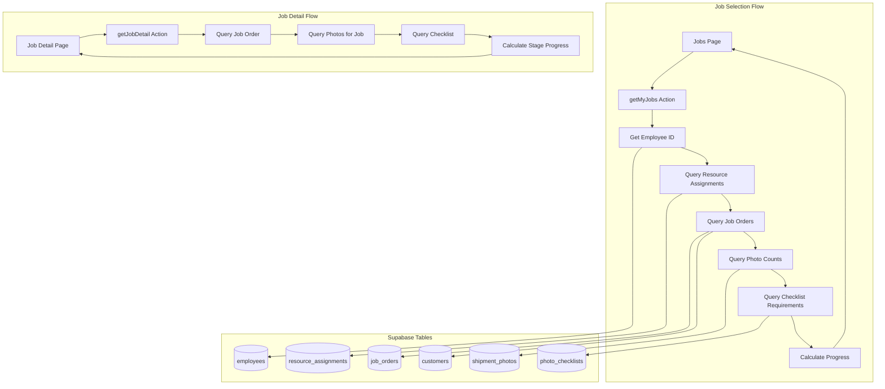
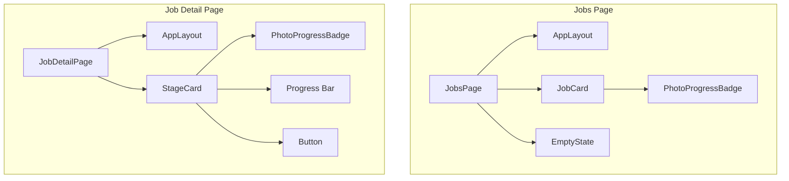
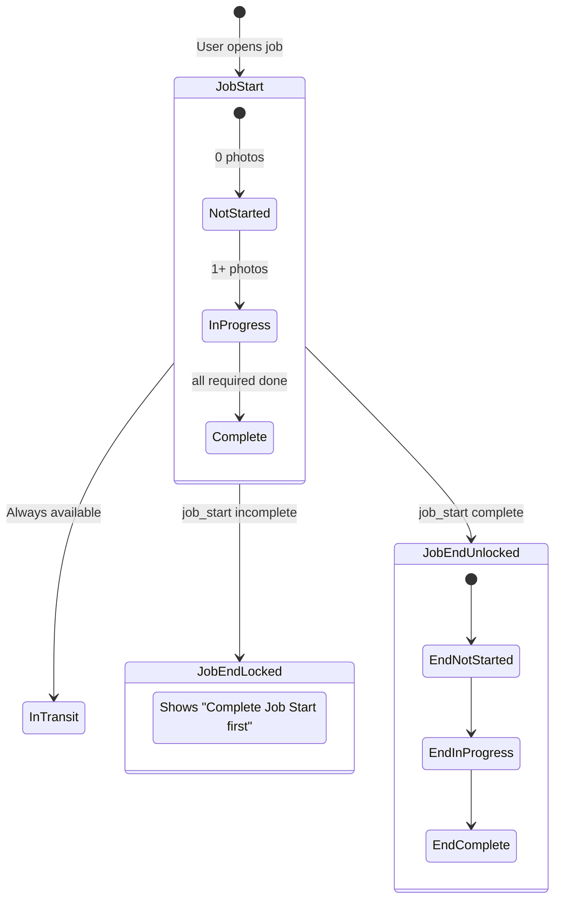

# Design Document: v0.2-job-selection

## Overview

This design document outlines the technical architecture for the Job Selection feature of GAMA Photo Capture PWA. This feature enables field staff to view their assigned jobs and see photo documentation status for each job, serving as the entry point to the guided capture flow.

The design prioritizes:
- **User Assignment Filtering**: Only showing jobs assigned to the current user via resource_assignments
- **Progress Visibility**: Clear visual indicators of photo completion status per stage
- **Stage Locking**: Enforcing sequential documentation (job_start before job_end)
- **Responsive UI**: Fast loading with proper loading/error states

## Architecture

### High-Level Data Flow



### Component Hierarchy



### Stage Locking Logic



## Components and Interfaces

### Directory Structure

```
app/(main)/jobs/
├── page.tsx                   # Job list page
└── [id]/
    └── page.tsx               # Job detail page

components/molecules/
├── job-card.tsx               # Job card with progress
├── stage-card.tsx             # Stage card with lock indicator
├── photo-progress-badge.tsx   # Progress badge with color coding
└── empty-state.tsx            # Empty/error state display

lib/actions/
└── jobs.ts                    # Server actions for job data

types/
└── job.ts                     # Job-related type definitions
```

### Component Interfaces

```typescript
// components/molecules/job-card.tsx
interface JobCardProps {
  job: JobWithProgress;
  onClick?: () => void;
  className?: string;
}

// components/molecules/stage-card.tsx
interface StageCardProps {
  stage: JobStage;
  progress: StageProgress;
  onStartCapture?: () => void;
  className?: string;
}

// components/molecules/photo-progress-badge.tsx
interface PhotoProgressBadgeProps {
  progress: StageProgress;
  showTotal?: boolean;
  size?: 'sm' | 'md';
  className?: string;
}
```

### Server Action Interfaces

```typescript
// lib/actions/jobs.ts
export async function getMyJobs(): Promise<{
  jobs: JobWithProgress[];
  error: string | null;
}>;

export async function getJobDetail(jobId: string): Promise<{
  job: JobWithProgress | null;
  checklist: PhotoChecklistItem[];
  error: string | null;
}>;
```

## Data Models

### Type Definitions

```typescript
// types/job.ts

// Job stages for photo capture
type JobStage = 'job_start' | 'in_transit' | 'job_end';

// Progress for a single stage
interface StageProgress {
  required: number;      // Required photos from checklist
  completed: number;     // Photos taken for this stage
  total: number;         // Total checklist items (required + optional)
  isComplete: boolean;   // All required photos taken
  isLocked: boolean;     // Stage is locked (job_end only)
}

// Job with photo progress for display
interface JobWithProgress {
  id: string;
  joNumber: string;
  description: string | null;
  status: string;
  customerName: string;
  assignmentDate: string;
  progress: {
    job_start: StageProgress;
    in_transit: StageProgress;
    job_end: StageProgress;
  };
}

// Stage status for UI display
type StageStatus = 'locked' | 'not_started' | 'in_progress' | 'complete';

// Status to color mapping
const STAGE_STATUS_COLORS: Record<StageStatus, string> = {
  locked: 'bg-muted text-muted-foreground',
  not_started: 'bg-red-100 text-red-700',
  in_progress: 'bg-yellow-100 text-yellow-700',
  complete: 'bg-green-100 text-green-700',
};
```

### Database Query Patterns

```typescript
// Get employee ID for current user
const { data: employee } = await supabase
  .from('employees')
  .select('id')
  .eq('user_id', user.id)
  .single();

// Get job assignments for employee
const { data: assignments } = await supabase
  .from('resource_assignments')
  .select('id, job_order_id, start_date, end_date, status')
  .eq('resource_id', employee.id)
  .not('job_order_id', 'is', null)
  .order('start_date', { ascending: false });

// Get job orders with customer info
const { data: jobOrders } = await supabase
  .from('job_orders')
  .select(`
    id, jo_number, description, status,
    customer:customers(id, name)
  `)
  .in('id', jobIds);

// Get photo counts per job
const { data: photos } = await supabase
  .from('shipment_photos')
  .select('job_order_id, stage, checklist_item_id')
  .in('job_order_id', jobIds)
  .eq('is_deleted', false);

// Get checklist requirements
const { data: checklist } = await supabase
  .from('photo_checklists')
  .select('id, stage, is_required')
  .eq('is_active', true);
```

### Progress Calculation Logic

```typescript
// Calculate required counts per stage from checklist
const requiredCounts = {
  job_start: checklist.filter(c => c.stage === 'job_start' && c.is_required).length,
  in_transit: checklist.filter(c => c.stage === 'in_transit' && c.is_required).length,
  job_end: checklist.filter(c => c.stage === 'job_end' && c.is_required).length,
};

// Count completed photos per stage
const completedCounts = {
  job_start: photos.filter(p => p.stage === 'job_start').length,
  in_transit: photos.filter(p => p.stage === 'in_transit').length,
  job_end: photos.filter(p => p.stage === 'job_end').length,
};

// Check if job_start is complete
const jobStartComplete = completedCounts.job_start >= requiredCounts.job_start;

// job_end is locked until job_start is complete
const jobEndLocked = !jobStartComplete;
```

## Correctness Properties

*A property is a characteristic or behavior that should hold true across all valid executions of a system—essentially, a formal statement about what the system should do. Properties serve as the bridge between human-readable specifications and machine-verifiable correctness guarantees.*

Based on the prework analysis, the following properties have been identified:

### Property 1: Job Filtering by User Assignment

*For any* authenticated user, the getMyJobs action SHALL only return jobs where the user has a corresponding resource_assignment record linking their employee ID to the job_order_id.

**Validates: Requirements 2.1.1**

### Property 2: Progress Calculation Accuracy

*For any* job with N photos in a stage and M required checklist items for that stage, the progress SHALL show completed=N and required=M, with isComplete=true if and only if N >= M.

**Validates: Requirements 2.2.1, 2.2.3**

### Property 3: Status-to-Color Mapping

*For any* StageProgress, the getStageStatus function SHALL return:
- 'locked' if isLocked is true
- 'complete' if isComplete is true
- 'in_progress' if completed > 0
- 'not_started' otherwise

And the corresponding color class SHALL be applied from STAGE_STATUS_COLORS.

**Validates: Requirements 2.2.2**

### Property 4: Required Fields Rendering

*For any* JobWithProgress passed to JobCard, the rendered output SHALL contain the joNumber, customerName, status, and progress indicators for job_start and job_end stages.

**Validates: Requirements 2.1.4, 2.3.1, 2.3.3**

### Property 5: Stage Card Presence

*For any* job detail page, exactly three StageCard components SHALL be rendered: one for 'job_start', one for 'in_transit', and one for 'job_end', each with a capture button.

**Validates: Requirements 2.3.2, 2.3.4**

### Property 6: Stage Locking Behavior

*For any* job:
- job_start stage SHALL never be locked (isLocked = false)
- in_transit stage SHALL never be locked (isLocked = false)
- job_end stage SHALL be locked (isLocked = true) if and only if job_start.isComplete = false

When a stage is locked, the UI SHALL display "Complete Job Start photos first" message and disable the capture button.

**Validates: Requirements 2.4.1, 2.4.2, 2.4.3**

## Error Handling

### Data Fetching Errors

| Error Scenario | Handling Strategy |
|----------------|-------------------|
| Not authenticated | Return error "Not authenticated", show login redirect |
| Employee record not found | Return error "Employee record not found", show error state |
| Job not found | Return null job, show "Job Not Found" empty state |
| Database query fails | Return error message, show retry button |

### UI Error States

```typescript
// Error state component usage
<EmptyState
  icon={<AlertCircle className="h-10 w-10 text-destructive" />}
  title="Error Loading Jobs"
  description={error}
  action={<Button onClick={loadJobs}>Try Again</Button>}
/>

// Empty state for no jobs
<EmptyState
  icon={<Briefcase className="h-10 w-10 text-muted-foreground" />}
  title="No Jobs Assigned"
  description="You don't have any jobs assigned yet."
  action={<Button onClick={loadJobs}>Refresh</Button>}
/>
```

### Loading States

- Jobs page shows spinner while loading
- Job detail page shows spinner while loading
- Refresh button shows spinning animation during refresh

## Testing Strategy

### Dual Testing Approach

This feature uses both unit tests and property-based tests:

- **Unit tests**: Verify component rendering, specific examples, edge cases
- **Property tests**: Verify universal properties across all valid inputs

### Property-Based Testing Configuration

- **Library**: fast-check for TypeScript property-based testing
- **Minimum iterations**: 100 per property test
- **Tag format**: `Feature: v0.2-job-selection, Property {number}: {property_text}`

### Test Categories

#### Unit Tests

1. **Component Rendering Tests**
   - JobCard renders all required fields
   - StageCard renders with correct status
   - PhotoProgressBadge shows correct colors
   - EmptyState renders with custom content

2. **Server Action Tests**
   - getMyJobs returns jobs for authenticated user
   - getMyJobs returns empty array for user with no assignments
   - getJobDetail returns job with progress
   - getJobDetail returns null for non-existent job

3. **Progress Calculation Tests**
   - Progress correctly calculated from photo counts
   - Stage locking logic works correctly
   - in_transit never locked

#### Property-Based Tests

1. **Property 1**: Job filtering
   - Generate random user IDs and job assignments
   - Verify only assigned jobs are returned

2. **Property 2**: Progress calculation
   - Generate random photo counts and checklist requirements
   - Verify progress calculation is accurate

3. **Property 3**: Status-to-color mapping
   - Generate random StageProgress objects
   - Verify correct status and color returned

4. **Property 4**: Required fields rendering
   - Generate random JobWithProgress objects
   - Verify all required fields appear in rendered output

5. **Property 5**: Stage card presence
   - Generate random job data
   - Verify all three stage cards rendered

6. **Property 6**: Stage locking behavior
   - Generate random job_start completion states
   - Verify job_end locking follows rules

### Test File Structure

```
__tests__/
├── components/
│   ├── job-card.test.tsx
│   ├── stage-card.test.tsx
│   └── photo-progress-badge.test.tsx
├── lib/
│   └── actions/
│       └── jobs.test.ts
├── properties/
│   └── job-selection.property.test.ts
└── types/
    └── job.test.ts
```
